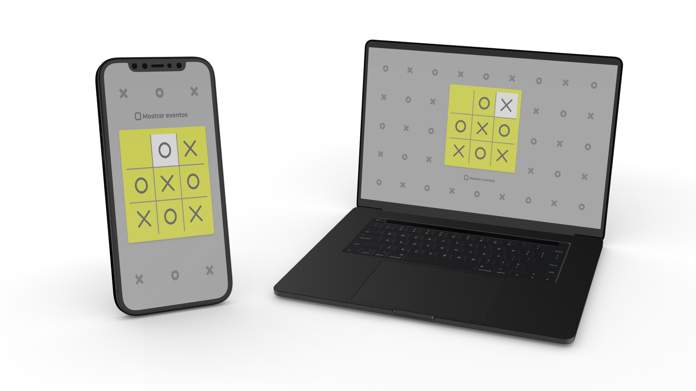
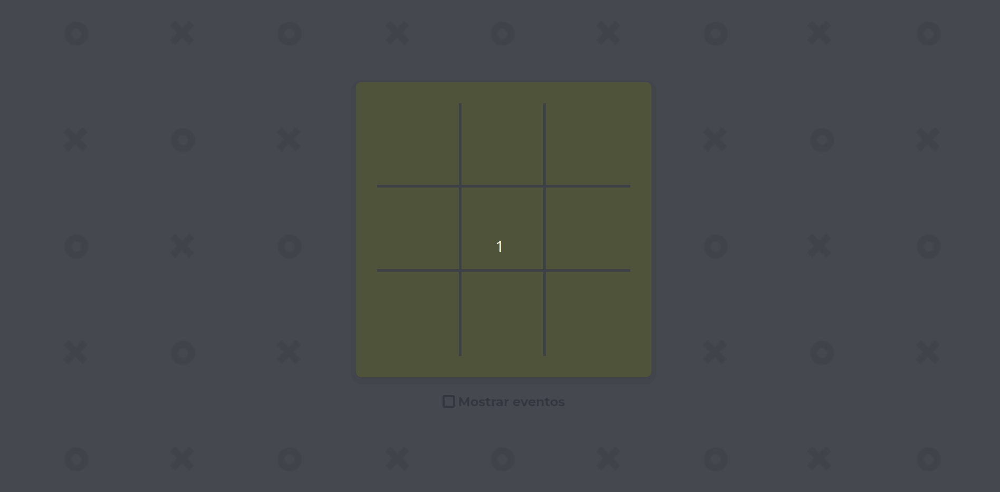

<h1 align="center">
  

  JOGO DA VELHA
</h1>

  <a href="#bookmark-sobre">Sobre</a>&nbsp;&nbsp;&nbsp;|&nbsp;&nbsp;&nbsp;
  <a href="#rocket-tecnologias">Tecnologias</a>&nbsp;&nbsp;&nbsp;|&nbsp;&nbsp;&nbsp;
  <a href="#paintbrush-layout">Layout</a>&nbsp;&nbsp;&nbsp;|&nbsp;&nbsp;&nbsp;
  <a href="https://tic-tac-toe-vanilla.vercel.app/" target="_blank">Aplicação na Vercel</a>

  

## :bookmark: Sobre

O **Jogo da Velha** é um jogo de tabuleiro de dois jogadores, X e O, que alternam entre si marcando os espaços em um tabuleiro 3x3. O jogador que conseguir colocar três de suas marcas em uma linha horizontal, vertical ou diagonal, vence o jogo. O projeto foi desenvolvido utilizando HTML, CSS e JavaScript Vanilla.

Para executar a aplicação, realize os passos a seguir:

* Clone o repositório ou realize um fork para o seu GitHub.
* Entre no diretório do projeto --> `cd tic-tac-toe`.
* Instale as dependências do projeto --> `npm install`.
* Execute a aplicação --> `npm run dev`.

 

  

## :rocket: Tecnologias

  - `HTML`
  > Linguagem de marcação utilizada na construção da interface.
  - `CSS`
  > Linguagem de estilização utilizada na construção da interface.
  - `JavaScript`
  > Linguagem de programação utilizada na construção da lógica da aplicação.
  - `Vercel`
  > Plataforma de hospedagem voltada para aplicações web modernas e escaláveis.

## :paintbrush: Layout

🔗 [LINK DO FIGMA](https://www.figma.com/file/oyDr2m96oLDbk90LqbZ3VS/Tic-Tac-Toe?type=design&node-id=0%3A1&mode=dev)

---
